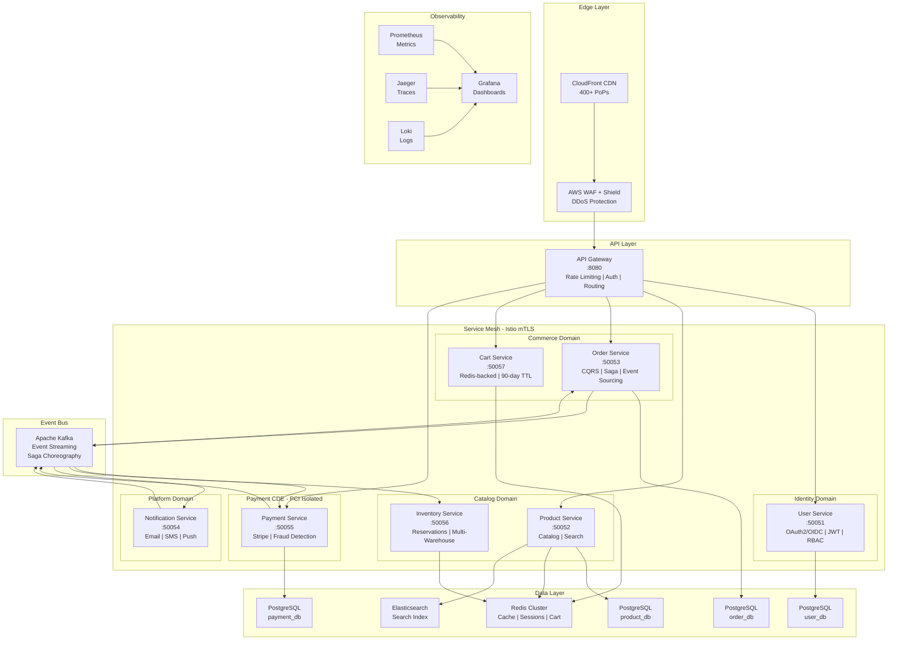
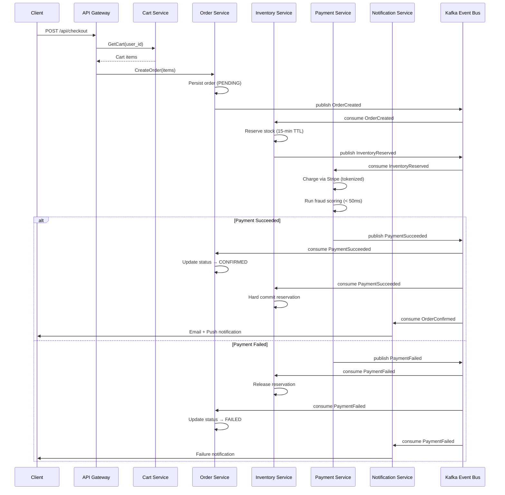
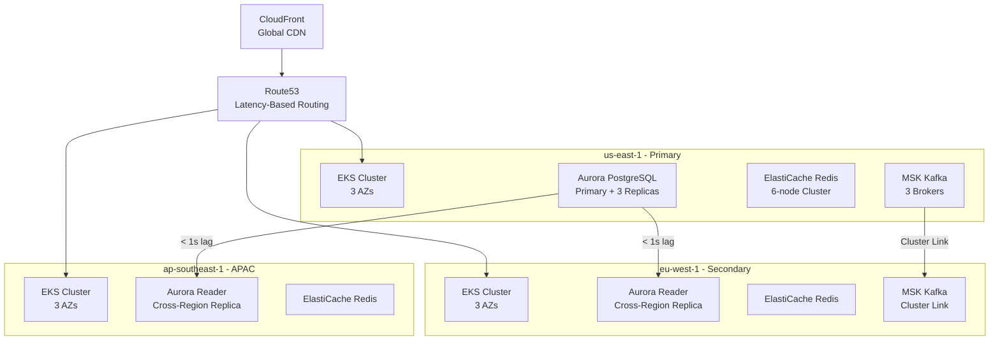

# Architecture Overview

## System Architecture — C4 Model

```mermaid
graph TB
    subgraph "Edge Layer"
        CDN["CloudFront CDN<br/>400+ PoPs"]
        WAF["AWS WAF + Shield<br/>DDoS Protection"]
    end

    subgraph "API Layer"
        APIGW["API Gateway<br/>:8080<br/>Rate Limiting | Auth | Routing"]
    end

    subgraph "Service Mesh - Istio mTLS"
        subgraph "Identity Domain"
            USER["User Service<br/>:50051<br/>OAuth2/OIDC | JWT | RBAC"]
        end

        subgraph "Catalog Domain"
            PRODUCT["Product Service<br/>:50052<br/>Catalog | Search"]
            INV["Inventory Service<br/>:50056<br/>Reservations | Multi-Warehouse"]
        end

        subgraph "Commerce Domain"
            CART["Cart Service<br/>:50057<br/>Redis-backed | 90-day TTL"]
            ORDER["Order Service<br/>:50053<br/>CQRS | Saga | Event Sourcing"]
        end

        subgraph "Payment CDE - PCI Isolated"
            PAY["Payment Service<br/>:50055<br/>Stripe | Fraud Detection"]
        end

        subgraph "Platform Domain"
            NOTIF["Notification Service<br/>:50054<br/>Email | SMS | Push"]
        end
    end

    subgraph "Event Bus"
        KAFKA["Apache Kafka<br/>Event Streaming<br/>Saga Choreography"]
    end

    subgraph "Data Layer"
        PG_USER["PostgreSQL<br/>user_db"]
        PG_PRODUCT["PostgreSQL<br/>product_db"]
        PG_ORDER["PostgreSQL<br/>order_db"]
        PG_PAY["PostgreSQL<br/>payment_db"]
        REDIS["Redis Cluster<br/>Cache | Sessions | Cart"]
        ES["Elasticsearch<br/>Search Index"]
    end

    subgraph "Observability"
        PROM["Prometheus<br/>Metrics"]
        GRAF["Grafana<br/>Dashboards"]
        JAEGER["Jaeger<br/>Traces"]
        LOKI["Loki<br/>Logs"]
    end

    CDN --> WAF --> APIGW
    APIGW --> USER
    APIGW --> PRODUCT
    APIGW --> ORDER
    APIGW --> CART
    APIGW --> PAY

    USER --> PG_USER
    PRODUCT --> PG_PRODUCT
    PRODUCT --> REDIS
    PRODUCT --> ES
    ORDER --> PG_ORDER
    ORDER --> KAFKA
    PAY --> PG_PAY
    PAY --> KAFKA
    INV --> REDIS
    CART --> REDIS
    NOTIF --> KAFKA

    KAFKA --> ORDER
    KAFKA --> PAY
    KAFKA --> INV
    KAFKA --> NOTIF

    PROM --> GRAF
    JAEGER --> GRAF
    LOKI --> GRAF
```

## Order Placement Saga Flow

```mermaid
sequenceDiagram
    participant Client
    participant Gateway as API Gateway
    participant Cart as Cart Service
    participant Order as Order Service
    participant Inventory as Inventory Service
    participant Payment as Payment Service
    participant Notif as Notification Service
    participant Kafka as Kafka Event Bus

    Client->>Gateway: POST /api/checkout
    Gateway->>Cart: GetCart(user_id)
    Cart-->>Gateway: Cart items

    Gateway->>Order: CreateOrder(items)
    Order->>Order: Persist order (PENDING)
    Order->>Kafka: publish OrderCreated

    Kafka->>Inventory: consume OrderCreated
    Inventory->>Inventory: Reserve stock (15-min TTL)
    Inventory->>Kafka: publish InventoryReserved

    Kafka->>Payment: consume InventoryReserved
    Payment->>Payment: Charge via Stripe (tokenized)
    Payment->>Payment: Run fraud scoring (< 50ms)

    alt Payment Succeeded
        Payment->>Kafka: publish PaymentSucceeded
        Kafka->>Order: consume PaymentSucceeded
        Order->>Order: Update status → CONFIRMED
        Kafka->>Inventory: consume PaymentSucceeded
        Inventory->>Inventory: Hard commit reservation
        Kafka->>Notif: consume OrderConfirmed
        Notif->>Client: Email + Push notification
    else Payment Failed
        Payment->>Kafka: publish PaymentFailed
        Kafka->>Inventory: consume PaymentFailed
        Inventory->>Inventory: Release reservation
        Kafka->>Order: consume PaymentFailed
        Order->>Order: Update status → FAILED
        Kafka->>Notif: consume PaymentFailed
        Notif->>Client: Failure notification
    end
```

## Deployment Topology

```mermaid
graph TB
    subgraph "us-east-1 - Primary"
        EKS1["EKS Cluster<br/>3 AZs"]
        RDS1["Aurora PostgreSQL<br/>Primary + 3 Replicas"]
        REDIS1["ElastiCache Redis<br/>6-node Cluster"]
        MSK1["MSK Kafka<br/>3 Brokers"]
    end

    subgraph "eu-west-1 - Secondary"
        EKS2["EKS Cluster<br/>3 AZs"]
        RDS2["Aurora Reader<br/>Cross-Region Replica"]
        REDIS2["ElastiCache Redis"]
        MSK2["MSK Kafka<br/>Cluster Link"]
    end

    subgraph "ap-southeast-1 - APAC"
        EKS3["EKS Cluster<br/>3 AZs"]
        RDS3["Aurora Reader<br/>Cross-Region Replica"]
        REDIS3["ElastiCache Redis"]
    end

    R53["Route53<br/>Latency-Based Routing"]
    CF["CloudFront<br/>Global CDN"]

    R53 --> EKS1
    R53 --> EKS2
    R53 --> EKS3
    CF --> R53

    RDS1 -->|"< 1s lag"| RDS2
    RDS1 -->|"< 1s lag"| RDS3
    MSK1 -->|"Cluster Link"| MSK2
```
